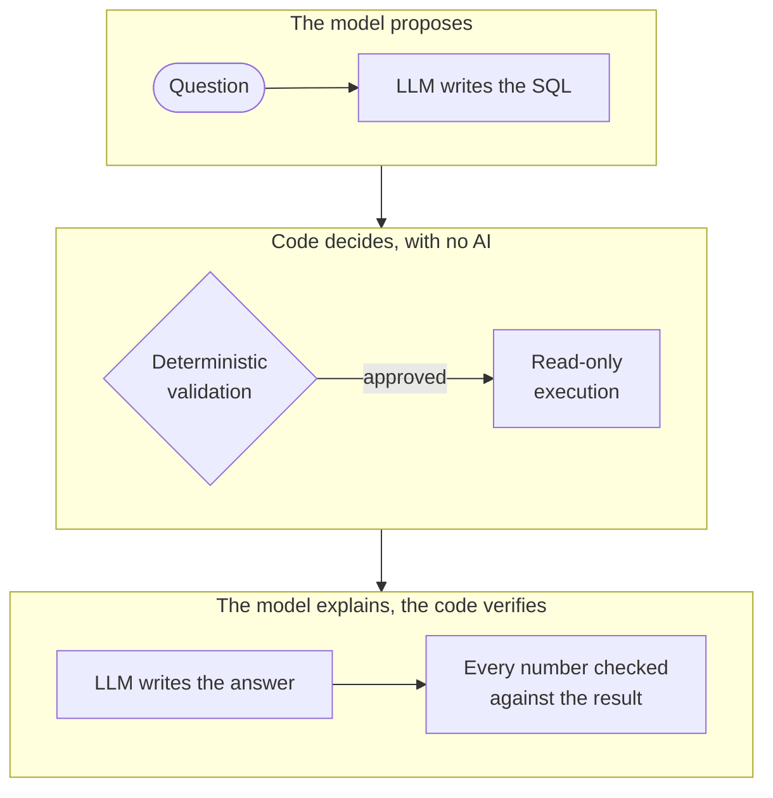
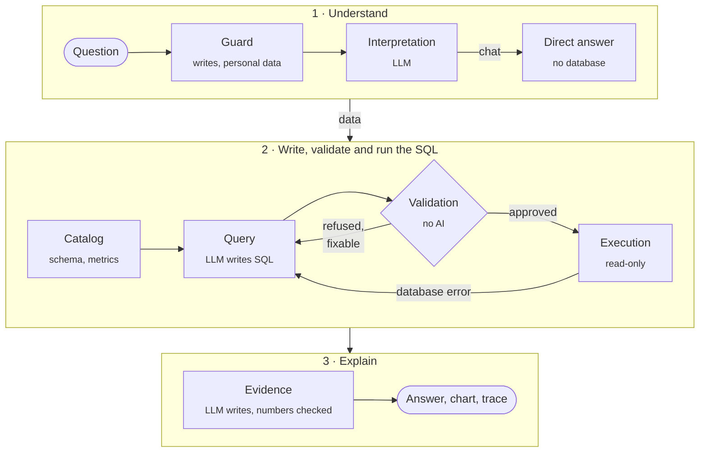

<p align="center">
  
</p>

<p align="center">
  <strong>An AI data analyst that runs on your machine, queries your databases read-only<br>
  and shows how it got to every number.</strong>
</p>

<p align="center">
  
  
  
  
  
  
  <a href="https://github.com/Rafalvesc/otter-data/actions/workflows/ci.yml"></a>
  <a href="https://github.com/Rafalvesc/otter-data/releases/latest"></a>
  <a href="LICENSE"></a>
</p>

<p align="center">
  <strong>English</strong> · <a href="README.pt-BR.md">Português</a>
</p>

<p align="center">
  <a href="#why-otter-data">Why</a> ·
  <a href="#how-it-works">How it works</a> ·
  <a href="#security">Security</a> ·
  <a href="#testing">Testing</a> ·
  <a href="#install-on-windows">Install</a>
</p>

<p align="center">
  
</p>

Ask "which regions had the highest revenue in September?" and Otter Data interprets the question, writes SQL, validates it against a deterministic policy, runs it on a read-only connection and answers in plain English (or Portuguese), with a chart and the full trace of the analysis. Connect PostgreSQL or MySQL, import CSV files, or try the built-in sample store. The model runs through [Ollama](https://ollama.com), either locally or through Ollama's hosted models. No application API key is required.

**Stack:** Python · FastAPI · LangGraph · Pydantic · sqlglot · Ollama · PostgreSQL · MySQL · DuckDB · pywebview · Docker · PyInstaller · vanilla JavaScript

## Why Otter Data?

Most text-to-SQL tools trust the model: it writes a query and the query runs. Otter Data treats the model as untrusted and checks its work at every step.



- **The LLM never executes SQL.** It only proposes a query; an AST validator ([sqlglot](https://github.com/tobymao/sqlglot)) decides whether it runs: one `SELECT`, approved tables and columns, allowlisted functions, no personal columns, and no sums or counts inflated by a one-to-many join.
- **Execution is constrained by the database, not by the prompt.** Read-only transactions, statement timeouts, row and byte limits and, on the bundled PostgreSQL, an account without write privileges.
- **Reported numbers are independently verified.** A verifier with no AI in it checks every number in the answer against the query result and flags any that don't match.

## What this project demonstrates

- **LLM orchestration** with LangGraph: a typed state graph with bounded retries and real-time progress.
- **Secure text-to-SQL:** AST validation, allowlists and read-only execution instead of prompt-only rules.
- **Deterministic guardrails around an LLM:** input guard, independent number check and chart validation.
- **Backend and API design** with FastAPI and Pydantic, including NDJSON streaming.
- **Database security:** separate privileged accounts, timeouts, result limits and credentials kept in the OS vault.
- **Testing and evaluation:** 351 automated tests, reference answers computed independently and CI with GitHub Actions.
- **Shipping a product:** Windows desktop app, PyInstaller and Inno Setup installer built by a release workflow, and an English/Portuguese interface.

## Features

- **Natural conversation with memory.** Follow-ups like "and in August?" work, and general questions are answered without touching the database.
- **Your own data.** PostgreSQL, MySQL (password kept in the Windows Credential Manager) or CSV files imported into a local DuckDB database. Columns that look like personal data are hidden.
- **Charts on request.** "Make a pie chart of revenue by category." The AI only picks the chart type and the columns; the backend checks them against the data before drawing.
- **A visible trace.** "How did we get here?" shows the interpretation, the catalog fields used, the executed SQL, the validation, the execution and the evidence for each answer.
- **Error recovery.** When the SQL is refused or the database rejects it, the reason goes back to the model as a fixed hint for one retry. Raw database messages are never passed on, because they may contain data.
- **English or Portuguese**, switchable in the sidebar, including the answers and the number formats.
- **Windows desktop app** with an installer, or a web interface served by the backend.

<table>
  <tr>
    <td></td>
    <td></td>
  </tr>
  <tr>
    <td align="center"><em>"How did we get here?": every step, from SQL to evidence</em></td>
    <td align="center"><em>Chart on request, dark theme</em></td>
  </tr>
</table>

## How it works

The analysis is a [LangGraph](https://github.com/langchain-ai/langgraph) graph with deterministic steps between the model calls:



- **Up to 4 model calls per question:** interpret, write the SQL, an optional rewrite and write the answer.
- **Two query modes:** **versioned metrics** such as "received revenue" ([`backend/semantic/`](backend/semantic)), where the SQL follows a fixed plan with parameters the model cannot change; and **exploration**, free-form SELECT that is always validated.
- **The written answer** is based on at most 50 result rows, and only if the source allows the AI to read results; otherwise the answer shows only the computed values.

## Security

| Layer | What it guarantees |
|---|---|
| Input guard | Requests to write data or to read personal data are refused before reaching the model. |
| SQL validator (AST) | A single `SELECT`; catalog tables and columns only; joins only on documented keys; allowlisted functions and types; no `UNION`, recursive CTEs, system catalogs or sensitive columns. `SUM`, `AVG` and `COUNT` are refused when a one-to-many join would repeat the measured rows (a payment summed once per item). A parsing failure blocks execution. |
| Execution | Read-only transaction, `statement_timeout` and row and byte limits. On the sample PostgreSQL, an account without write privileges and `search_path` pinned to `pg_catalog`. |
| Credentials | The model never receives passwords. Passwords for your own sources live in the Windows Credential Manager, never in a file. |
| Data sent to the model | Table and column names. Result rows only when the source allows it, and at most 50. |
| Output | AI text is rendered as text, never as HTML. Charts are drawn from a validated specification, never from generated code. |
| Logs | No SQL, values, rows, passwords or database messages. |

Threat model and design decisions: [docs/security.md](docs/security.md) (Portuguese).

## Testing

The automated suite (351 tests, including real PostgreSQL) covers validator acceptance and rejection cases, the executors' limits and the number check. Reference answers for the sample data are computed independently in Python from the same deterministic generator ([`golden_questions.json`](evaluation/datasets/golden_questions.json)), so "the SQL ran" never counts as correct: the number has to match. Every round of manual verification is logged in [docs/historico-de-validacao.md](docs/historico-de-validacao.md) (Portuguese).

## Install on Windows

1. **Install [Ollama](https://ollama.com/download).** For the default hosted model (`gemma4:31b-cloud`), run `ollama signin` once. To work offline, pull a local model such as `ollama pull qwen2.5:7b`; it shows up in the app's model picker.
2. **Download `OtterData-Setup-<version>.exe`** from [Releases](../../releases/latest) and run it. No administrator rights needed.
3. **Open Otter Data** and click **Connect database** or **Import CSV**, or try the sample questions.

> The installer is not code-signed, so SmartScreen may show "Unknown publisher": click **More info → Run anyway**. It is built from this repository by GitHub Actions ([release.yml](.github/workflows/release.yml)).

## Run from source

```powershell
py -3.12 -m venv .venv
.\.venv\Scripts\python.exe -m pip install -r requirements.lock -r requirements-desktop.lock
.\.venv\Scripts\python.exe -m pip install --no-deps -e .
.\.venv\Scripts\python.exe -m desktop
```

Full mode with PostgreSQL in Docker, configuration, tests, building the installer and the project layout: [docs/development.md](docs/development.md).

## Limitations

- The desktop app and the installer are **Windows only**; the web interface runs anywhere the backend runs.
- Conversations are stored on this device only, and memory applies within the open conversation.
- Answers depend on the model. Validation stops out-of-policy queries, but it cannot guarantee the question was understood the way you meant: check the assumptions in "How did we get here?".
- Correlation and descriptive comparison are not causation, and the assistant is instructed to say so.
- The model prompts and the internal docs in `docs/` are written in Portuguese; the interface and the answers follow the language you choose.

## License

[MIT](LICENSE) © 2026 Rafael Costa. The Fraunces, DM Sans and JetBrains Mono fonts are distributed under the SIL Open Font License ([licenses](frontend/assets/fonts/LICENSE.md)).
