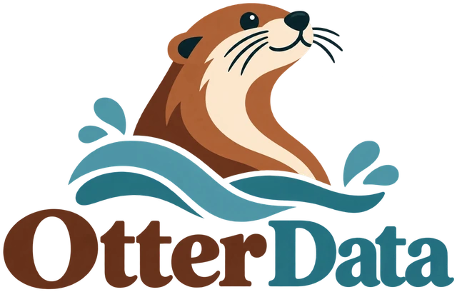
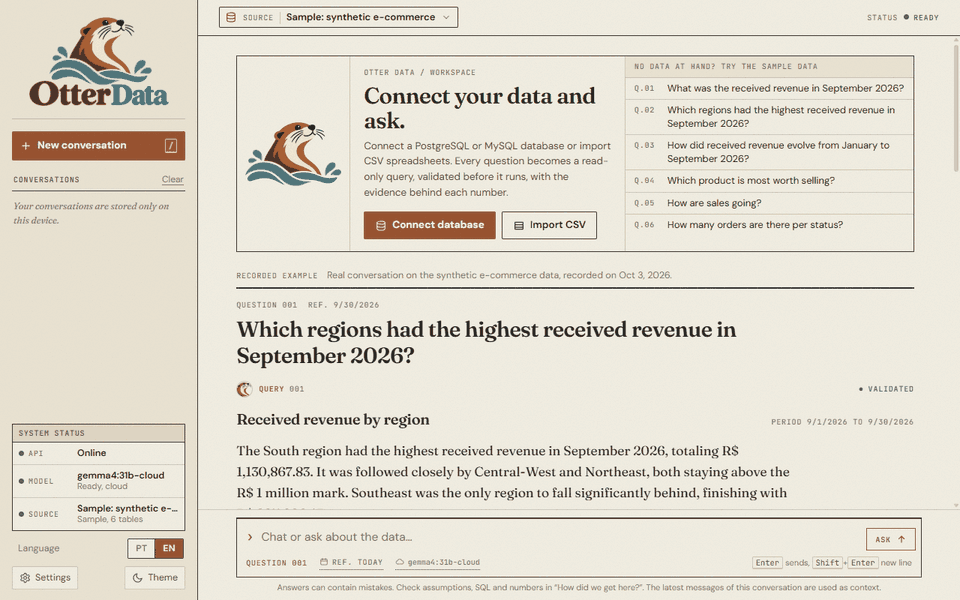
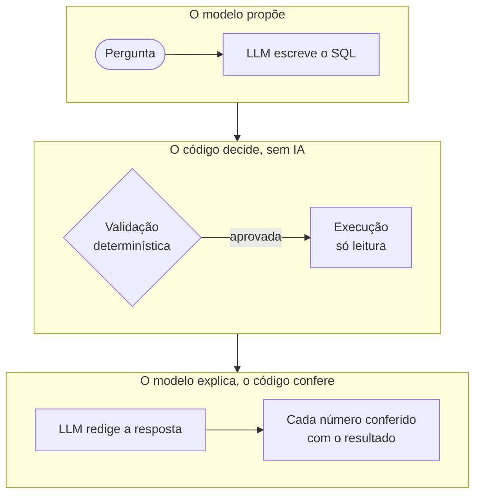
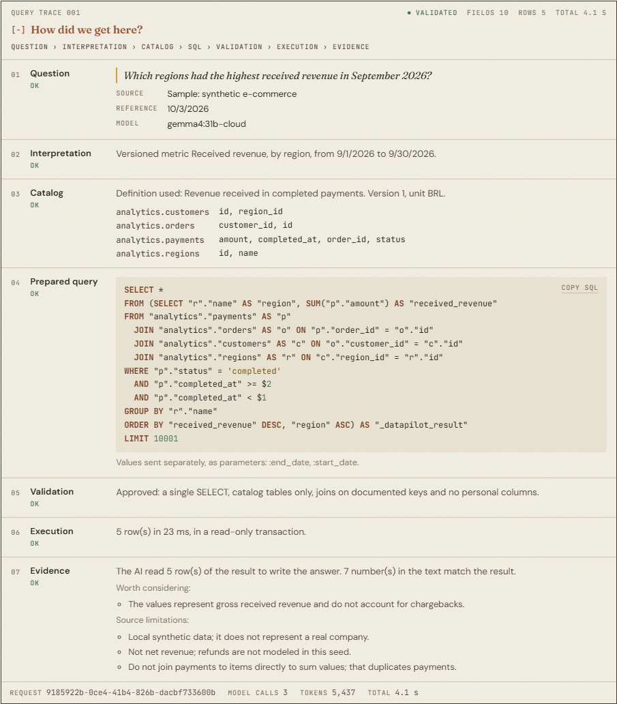
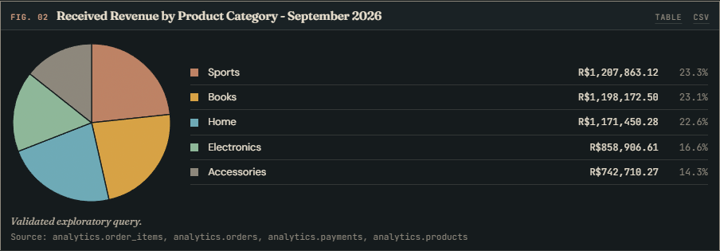
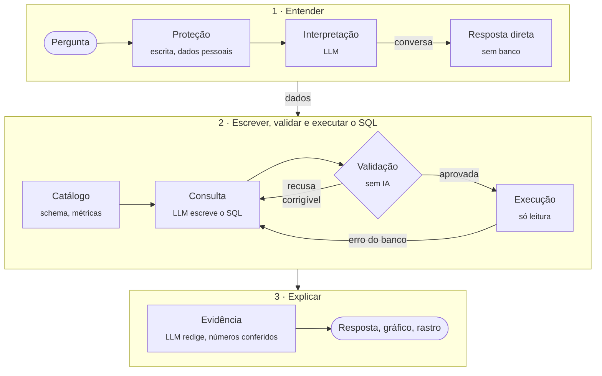

<p align="center">
  
</p>

<p align="center">
  <strong>Analista de dados com IA que roda na sua máquina, consulta suas bases só para leitura<br>
  e mostra como chegou a cada número.</strong>
</p>

<p align="center">
  
  
  
  
  
  
  <a href="https://github.com/Rafalvesc/otter-data/actions/workflows/ci.yml"></a>
  <a href="https://github.com/Rafalvesc/otter-data/releases/latest"></a>
  <a href="LICENSE"></a>
</p>

<p align="center">
  <a href="README.md">English</a> · <strong>Português</strong>
</p>

<p align="center">
  <a href="#por-que-otter-data">Por quê</a> ·
  <a href="#como-funciona">Como funciona</a> ·
  <a href="#segurança">Segurança</a> ·
  <a href="#testes">Testes</a> ·
  <a href="#instalar-no-windows">Instalar</a>
</p>

<p align="center">
  
</p>

Pergunte "quais regiões tiveram maior receita em setembro?" e o Otter Data interpreta a pergunta, escreve o SQL, valida contra uma política determinística, executa numa conexão somente leitura e responde em português (ou inglês), com gráfico e o rastro completo da análise. Conecte PostgreSQL ou MySQL, importe CSV ou teste com a loja de exemplo embutida. O modelo roda pelo [Ollama](https://ollama.com), localmente ou nos modelos hospedados do Ollama. O app não exige chave de API.

**Stack:** Python · FastAPI · LangGraph · Pydantic · sqlglot · Ollama · PostgreSQL · MySQL · DuckDB · pywebview · Docker · PyInstaller · JavaScript puro

## Por que Otter Data?

A maioria das ferramentas de texto para SQL confia no modelo: ele escreve a consulta e a consulta roda. O Otter Data trata o modelo como não confiável e confere o trabalho dele em cada etapa.



- **O LLM nunca executa SQL.** Ele só propõe a consulta; um validador de AST ([sqlglot](https://github.com/tobymao/sqlglot)) decide se ela roda: um único `SELECT`, tabelas e colunas aprovadas, funções permitidas, nenhuma coluna pessoal e nenhuma soma ou contagem inflada por um join um para muitos.
- **A execução é limitada pelo banco, não pelo prompt.** Transação somente leitura, tempo limite, limite de linhas e bytes e, no PostgreSQL do projeto, uma conta sem permissão de escrita.
- **Os números da resposta são conferidos de forma independente.** Um verificador sem IA compara cada número do texto com o resultado da consulta e aponta os que não batem.

## O que este projeto demonstra

- **Orquestração de LLM** com LangGraph: grafo de estado tipado, novas tentativas limitadas e progresso em tempo real.
- **Texto para SQL com segurança:** validação por AST, allowlists e execução somente leitura, em vez de regras só no prompt.
- **Proteções determinísticas em volta do LLM:** filtro de entrada, conferência independente dos números e validação de gráficos.
- **Backend e APIs** com FastAPI e Pydantic, incluindo streaming em NDJSON.
- **Segurança de banco de dados:** contas com privilégios separados, tempo limite, limites de resultado e senhas no cofre do sistema.
- **Testes e avaliação:** 351 testes automatizados, respostas de referência calculadas de forma independente e CI com GitHub Actions.
- **Entrega de produto:** app desktop para Windows, instalador com PyInstaller e Inno Setup gerado por workflow de release, e interface em inglês e português.

## Recursos

- **Conversa natural com memória.** Continuações como "e em agosto?" funcionam, e perguntas gerais são respondidas sem consultar o banco.
- **Seus próprios dados.** PostgreSQL, MySQL (senha no Cofre de Credenciais do Windows), MongoDB (copiado para uma base local somente leitura: subdocumentos viram colunas e listas de subdocumentos viram tabelas ligadas) ou CSV importado para um DuckDB local. Colunas com cara de dado pessoal ficam ocultas, e o modelo só conhece os valores reais de colunas de categoria (como um status) nas bases em que você permite a leitura de resultados.
- **Gráficos sob pedido.** "Faça um gráfico de pizza da receita por categoria." A IA escolhe só o tipo e as colunas; o backend confere contra os dados antes de desenhar.
- **Rastro visível.** "Como chegamos aqui?" mostra a interpretação, os campos do catálogo, o SQL executado, a validação, a execução e as evidências de cada resposta.
- **Recuperação de erros.** Quando o SQL é recusado ou o banco o rejeita, o motivo volta ao modelo como uma dica fixa para uma nova tentativa. A mensagem do banco nunca é repassada, porque pode conter dados.
- **Inglês ou português**, com seletor na barra lateral, inclusive nas respostas e no formato dos números.
- **App desktop para Windows** com instalador, ou interface web servida pelo backend.

<table>
  <tr>
    <td></td>
    <td></td>
  </tr>
  <tr>
    <td align="center"><em>"Como chegamos aqui?": cada etapa, do SQL à evidência</em></td>
    <td align="center"><em>Gráfico sob pedido, no tema escuro</em></td>
  </tr>
</table>

## Como funciona

A análise é um grafo do [LangGraph](https://github.com/langchain-ai/langgraph) com etapas determinísticas entre as chamadas ao modelo:



- **Até 4 chamadas ao modelo por pergunta:** interpretar, escrever o SQL, uma eventual reescrita e redigir a resposta.
- **Dois modos de consulta:** **métricas versionadas**, como "receita recebida" ([`backend/semantic/`](backend/semantic)), em que o SQL segue um plano fixo com parâmetros que o modelo não pode mudar; e **exploração**, SELECT livre, sempre validado.
- **A resposta em texto** usa no máximo 50 linhas do resultado, e só se a base permitir que a IA leia resultados; sem isso, mostra apenas os valores calculados.

## Segurança

| Camada | O que garante |
|---|---|
| Proteção na entrada | Pedidos de escrita ou de dados pessoais são recusados antes de chegar ao modelo. |
| Validador de SQL (AST) | Um único `SELECT`; tabelas e colunas do catálogo; joins só pelas chaves documentadas; allowlist de funções e tipos; sem `UNION`, CTE recursiva, catálogos do sistema ou colunas sensíveis. `SUM`, `AVG` e `COUNT` são recusados quando um join um para muitos repetiria as linhas medidas (um pagamento somado uma vez por item). Falha de parsing bloqueia a execução. |
| Execução | Transação somente leitura, `statement_timeout` e limite de linhas e bytes. No PostgreSQL de exemplo, conta sem privilégio de escrita e `search_path` fixo em `pg_catalog`. |
| Credenciais | O modelo nunca recebe senhas. Senhas de bases próprias ficam no Cofre de Credenciais do Windows, nunca em arquivo. |
| Dados ao modelo | Nomes de tabelas e colunas. Linhas do resultado só quando a base permite, e no máximo 50. |
| Saída | O texto da IA é exibido como texto, nunca como HTML. Gráficos são desenhados a partir de uma especificação validada, nunca de código gerado. |
| Logs | Sem SQL, valores, linhas, senhas ou mensagens do banco. |

Ameaças consideradas e decisões de projeto: [docs/security.md](docs/security.md).

## Testes

A suíte automatizada (351 testes, incluindo PostgreSQL real) cobre casos de aceitação e recusa do validador, os limites dos executores e a conferência de números. As respostas de referência da base de exemplo são calculadas de forma independente em Python, a partir do mesmo gerador determinístico ([`golden_questions.json`](evaluation/datasets/golden_questions.json)); "o SQL executou" nunca conta como acerto: o número precisa bater. Cada rodada de verificação manual está registrada em [docs/historico-de-validacao.md](docs/historico-de-validacao.md).

## Instalar no Windows

1. **Instale o [Ollama](https://ollama.com/download).** Para o modelo hospedado padrão (`gemma4:31b-cloud`), rode `ollama signin` uma vez. Para usar sem internet, baixe um modelo local, como `ollama pull qwen2.5:7b`; ele aparece no seletor de modelos do app.
2. **Baixe `OtterData-Setup-<versão>.exe`** em [Releases](../../releases/latest) e execute. Não precisa de permissão de administrador.
3. **Abra o Otter Data** e clique em **Connect database** ou **Import CSV** (ou troque para PT na barra lateral), ou teste com as perguntas de exemplo.

> O instalador não é assinado digitalmente, então o SmartScreen pode avisar "Editor desconhecido": clique em **Mais informações → Executar assim mesmo**. Ele é gerado a partir deste repositório pelo GitHub Actions ([release.yml](.github/workflows/release.yml)).

## Rodar pelo código-fonte

```powershell
py -3.12 -m venv .venv
.\.venv\Scripts\python.exe -m pip install -r requirements.lock -r requirements-desktop.lock
.\.venv\Scripts\python.exe -m pip install --no-deps -e .
.\.venv\Scripts\python.exe -m desktop
```

Modo completo com PostgreSQL no Docker, configuração, testes, geração do instalador e estrutura do projeto: [docs/development.md](docs/development.md) (em inglês).

## Limitações

- O app desktop e o instalador são **só para Windows**; a interface web roda em qualquer sistema que rode o backend.
- As conversas ficam só neste aparelho, e a memória vale dentro da conversa aberta.
- Respostas dependem do modelo. A validação impede consultas fora da política, mas não garante que a pergunta foi entendida como você queria: confira as premissas em "Como chegamos aqui?".
- Correlação e comparação descritiva não são causalidade, e a assistente é instruída a dizer isso.
- Os dados da base de exemplo estão em inglês (regiões, categorias, produtos e status), também com a interface em português. A tela de abertura do app desktop é só em inglês.

## Licença

[MIT](LICENSE) © 2026 Rafael Costa. As fontes Fraunces, DM Sans e JetBrains Mono são distribuídas sob a SIL Open Font License ([licenças](frontend/assets/fonts/LICENSE.md)).
